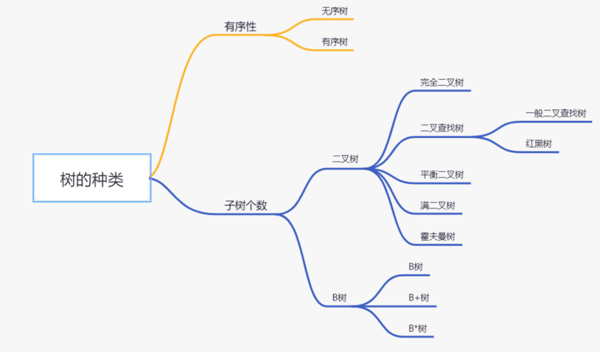
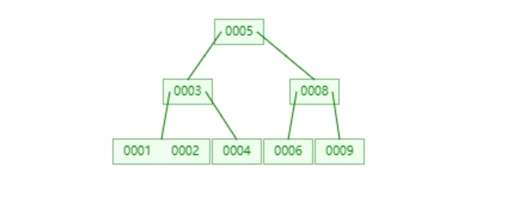
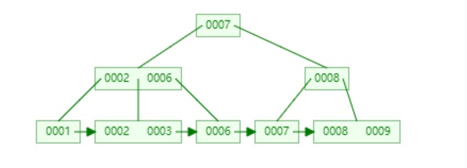
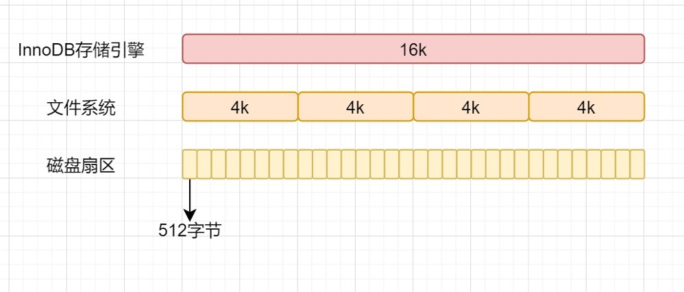

# 树
## 树的分类

按照有序性，可以分为有序树和无序树：
- 无序树：树中任意节点的子结点之间没有顺序关系
- 有序树：树中任意节点的子结点之间有顺序关系

按照节点包含子树个数，可以分为B树和二叉树，二叉树可以分为以下几种：
- 二叉树：每个节点最多含有两个子树的树称为二叉树；
- 二叉查找树：首先它是一颗二叉树，若左子树不空，则左子树上所有结点的值均小于它的根结点的值；若右子树不空，则右子树上所有结点的值均大于它的根结点的值；左、右子树也分别为二叉排序树；
- 满二叉树：叶节点除外的所有节点均含有两个子树的树被称为满二叉树；
- 完全二叉树：如果一颗二叉树除去最后一层节点为满二叉树，且最后一层的结点依次从左到右分布
- 霍夫曼树：带权路径最短的二叉树。
- 红黑树：红黑树是一颗特殊的二叉查找树，每个节点都是黑色或者红色，根节点、叶子节点是黑色。如果一个节点是红色的，则它的子节点必须是黑色的。
- 平衡二叉树（AVL）：一棵空树或它的左右两个子树的高度差的绝对值不超过1，并且左右两个子树都是一棵平衡二叉树

## B-树 
B-树，也称为B树，是一种平衡的多叉树，它比较适用于对外查找。
- 阶数：一个节点最多有多少个孩子节点。（一般用字母m表示）
- 关键字：节点上的数值就是关键字
- 度：一个节点拥有的子节点的数量。

一棵m阶B树(balanced tree of order m)是一棵平衡的m路搜索树。它或者是空树，或者是满足下列性质的树：
- 1、根结点至少有两个子女；
- 2、每个非根节点所包含的关键字个数 j 满足：⌈m/2⌉ - 1 <= j <= m - 1.(⌈⌉表示向上取整)
- 3、除根结点以外的所有结点（不包括叶子结点）的度数正好是关键字总数加1，故内部子树个数 k 满足：⌈m/2⌉ <= k <= m ；
- 4、所有的叶子结点都位于同一层。

## B+树
B+树是B-树的变体，也是一颗多路搜索树。B+树是一种树数据结构，通常用于数据库和操作系统的文件系统中。B+树的特点是能够保持数据稳定有序，其插入与修改拥有较稳定的对数时间复杂度。B+树元素自底向上插入，这与二叉树恰好相反。
- 每个结点至多有m个子女
- 除根结点外，每个结点至少有[m/2]个子女，根结点至少有两个子女；
- 有k个子女的结点必有k个关键字。
- 相邻叶子节点是通过指针连起来的，并且是关键字大小排序的。

## B树与B+树区别？
- B-树内部节点是保存数据的;而B+树内部节点是不保存数据的，只作索引作用，它的叶子节点才保存数据。
- B+树相邻的叶子节点之间是通过链表指针连起来的，B-树却不是。
- 查找过程中，B-树在找到具体的数值以后就结束，而B+树则需要通过索引找到叶子结点中的数据才结束
- B-树中任何一个关键字出现且只出现在一个结点中，而B+树可以出现多次。

## InnoDB一棵B+树可以存放多少行数据？
答：千万级别
- 在计算机中，磁盘存储数据最小单元是扇区，一个扇区的大小是512字节。
- 文件系统中，最小单位是块，一个块大小就是4k；
- InnoDB存储引擎最小储存单元是页，一页大小就是16k。
- 因为B+树叶子存的是数据，内部节点存的是键值+指针。索引组织表通过非叶子节点的二分查找法以及指针确定数据在哪个页中，进而再去数据页中找到需要的数据；

假设B+树的高度为2的话，即有一个根结点和若干个叶子结点。这棵B+树的存放总记录数为=根结点指针数*单个叶子节点记录行数。
- 如果一行记录的数据大小为1k，那么单个叶子节点可以存的记录数 =16k/1k =16.
- 非叶子节点内存放多少指针呢？我们假设主键ID为bigint类型，长度为8字节，而指针大小在InnoDB源码中设置为6字节，所以就是8+6=14字节，16k/14B =16*1024B/14B = 1170
- 因此，一棵高度为2的B+树，能存放1170 * 16=18720条这样的数据记录。同理一棵高度为3的B+树，能存放1170 *1170 *16 =21902400，也就是说，可以存放两千万左右的记录。B+树高度一般为1-3层，已经满足千万级别的数据存储。

## 为什么索引结构默认使用B+树，而不是B-Tree，Hash哈希，二叉树，红黑树？
- Hash哈希，只适合等值查询，不适合范围查询；占内存，会碰撞。
- 一般二叉树，可能会特殊化为一个链表，相当于全表扫描。
- 红黑树，是一种特化的平衡二叉树，MySQL 数据量很大的时候，索引的体积也会很大，内存放不下的而从磁盘读取，树的层次太高的话，读取磁盘的次数就多了。
- B-Tree，叶子节点和非叶子节点都保存数据，相同的数据量，B+树更矮壮，也是就说，相同的数据量，B+树数据结构，查询磁盘的次数会更少。
