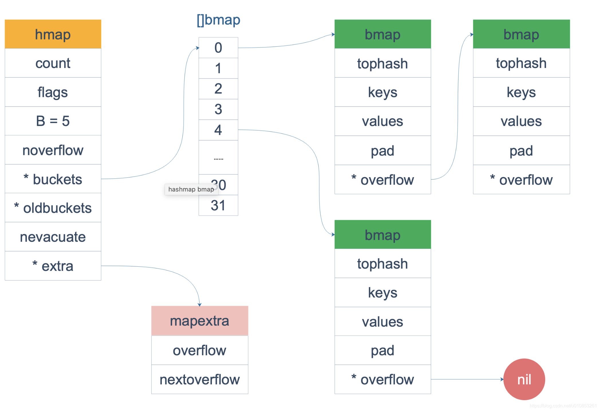

# golang源码
## chan
### 源码文件
src/runtime/chan.go
### 数据结构
```golang
type hchan struct {
	qcount   uint           // 队列剩余元素个数
	dataqsiz uint           // 环形队列长度
	buf      unsafe.Pointer // 环形队列指针
	elemsize uint16         // 每个元素大小
	closed   uint32         // 关闭标识
	elemtype *_type         // 元素类型
	sendx    uint           // 队列下标，元素写入数据队列位置
	recvx    uint           // 队列下标，元素数据从该位置读取
	recvq    waitq          // 等待读消息的goroutine队列
	sendq    waitq          // 等待写消息的goroutine队列

	// lock protects all fields in hchan, as well as several
	// fields in sudogs blocked on this channel.
	//
	// Do not change another G's status while holding this lock
	// (in particular, do not ready a G), as this can deadlock
	// with stack shrinking.
	lock mutex              // 互斥锁，chan不允许并发读写
}
```
## map
### 源码文件
src/runtime/map.go
### 数据结构
```golang
// A header for a Go map.
type hmap struct {
	count     int       // 键值对个数
	flags     uint8     // 状态标识
	B         uint8     // bucket数组的大小
	noverflow uint16 
	hash0     uint32    // hash 因子

	buckets    unsafe.Pointer // bucket数组指针，数组的大小为2^B
	oldbuckets unsafe.Pointer // previous bucket array of half the size, non-nil only when growing
	nevacuate  uintptr        // progress counter for evacuation (buckets less than this have been evacuated)

	extra *mapextra // optional fields
}

// mapextra holds fields that are not present on all maps.
type mapextra struct {
	overflow    *[]*bmap
	oldoverflow *[]*bmap

	nextOverflow *bmap
}

// A bucket for a Go map.
type bmap struct {
    tophash [bucketCnt]uint8
}
// 编译期重构的结构 bmap
type bmap struct {
    tophash  [8]uint8       // 每个key哈希值的高8位，加速访问；
    keys     [8]keytype
    values   [8]valuetype
    pad      uintptr
    overflow uintptr
}
```

### 注解
 - map使用hash表实现，并使用拉链法解决冲突。
 - map的value不可寻址,扩容过程中会发生键值对迁移。
 - map遍历时加入了随机数，让每次遍历的起始bucket的位置不一样。
 - 一个hmap存放了一个（数组大小为2^B个）buckets数组指针，
每个buckets可以存储8个键值对，当每个bucket存储的kv对到达8个之后，
会通过overflow指针指向一个新的bucket，从而形成一个链表。
随着键值对数量的增加，溢出桶的数量和哈希的装载因子也会逐渐升高，超过一定范围就会触发扩容，扩容会将桶的数量翻倍。

### key 定位过程
    key 经过哈希计算后得到哈希值，共 64 个 bit 位（64位机），
    计算它到底要落在哪个桶时，只会用到最后 B 个 bit 位。
    如果 B = 5，那么桶的数量，也就是 buckets 数组的长度是 2^5 = 32。
    eg : 10010111 | 000011110110110010001111001010100010010110010101010 │ 01010
    高八位 10010111 为桶的位置
    低B（5）位 01010 为桶的编号

### 插入
    装载因子已经超过 6.5；翻倍扩容
    // Maximum average load of a bucket that triggers growth is 6.5.
    // Represent as loadFactorNum/loadFactDen, to allow integer math.
    loadFactorNum = 13
    loadFactorDen = 2
    
 - 装载因子:=元素数量÷桶数量；
 - 哈希在存储元素过多时会触发扩容操作，每次都会将桶的数量翻倍，
 扩容过程不是原子的，而是通过 runtime.growWork 增量触发的，
 在扩容期间访问哈希表时会使用旧桶，向哈希表写入数据时会触发旧桶元素的分流(取模或者位操作来获取桶的编号)。
 除了这种正常的扩容之外，为了解决大量写入、删除造成的内存泄漏问题，哈希引入了 sameSizeGrow 这一机制，在出现较多溢出桶时会整理哈希的内存减少空间的占用。

### 删除
    哈希使用了太多溢出桶；等量扩容

### 查找
    1. 根据key计算出哈希值
    2. 根据哈希值低位确定所在bucket
    3. 根据哈希值高8位确定在bucket中的存储位置
    4. 当前bucket未找到则查找对应的overflow bucket。
    5. 对应位置有数据则对比完整的哈希值，确定是否是要查找的数据
    6. 如果当前处于map进行了扩容，处于数据搬移状态，则优先从oldbuckets查找。

## slice
### 源码文件
src/runtime/slice.go
### 数据结构
```golang
type slice struct {
	array unsafe.Pointer    // 指向数组地址
	len   int               // 长度
	cap   int               // 容量
}
```
### 扩容
    如果原Slice容量小于1024，则新Slice容量将扩大为原来的2倍;
    如果原Slice容量大于等于1024，则新Slice容量将扩大为原来的1.25倍;

## unsafe.Sizeof


# MySQL
## 什么是事务
数据库的事务是指一组sql语句组成的数据库逻辑处理单元，在这组的sql操作中，要么全部执行成功，要么全部执行失败。
## 事务 ACID
- `原子性`(Atomicity)：一个事务（transaction）中的所有操作，要么全部完成，要么全部不完成，不会结束在中间某个环节。事务在执行过程中发生错误，会被回滚（Rollback）到事务开始前的状态，就像这个事务从来没有执行过一样。
- `一致性`(Consistency)：在事务开始之前和事务结束以后，数据库的完整性没有被破坏。这表示写入的资料必须完全符合所有的预设规则，这包含资料的精确度、串联性以及后续数据库可以自发性地完成预定的工作。
- `隔离性`(Isolation)：数据库允许多个并发事务同时对其数据进行读写和修改的能力，隔离性可以防止多个事务并发执行时由于交叉执行而导致数据的不一致。事务隔离分为不同级别，包括读未提交（Read uncommitted）、读提交（read committed）、可重复读（repeatable read）和串行化（Serializable）。
- `持久性`(Durability)：事务处理结束后，对数据的修改就是永久的，即便系统故障也不会丢失。
    
    ps：原子性、隔离性、持久性都是为了保障一致性而存在的，一致性也是最终的目的。

## 事务处理
1、用 BEGIN, ROLLBACK, COMMIT来实现
- BEGIN 开始一个事务
- ROLLBACK 事务回滚
- COMMIT 事务确认

2、直接用 SET 来改变 MySQL 的自动提交模式
- SET AUTOCOMMIT=0 禁止自动提交
- SET AUTOCOMMIT=1 开启自动提交
## 隔离级别（隔离性
### Read Uncommitted（读取未提交内容）RU
    在该隔离级别，所有事务都可以看到其他未提交事务的执行结果。
    读取未提交的数据，也被称之为脏读（Dirty Read）。
    set global transaction isolation level read uncommitted;
    eg:无法解决脏读

### Read Committed（读取提交内容）RC
    这是大多数数据库系统的默认隔离级别（但不是MySQL默认的）。它满足了隔离的简单定义：一个事务只能看见已经提交事务所做的改变。
    这种隔离级别 也支持所谓的不可重复读（Nonrepeatable Read），因为同一事务的其他实例在该实例处理其间可能会有新的commit，所以同一select可能返回不同结果。
    set global transaction isolation level read committed;
    eg:无法做到可重复读，也没办法解决幻读


### Repeatable Read（可重读）RR
    这是MySQL的默认事务隔离级别，它确保同一事务的多个实例在并发读取数据时，会看到同样的数据行。
    不过理论上，这会导致另一个棘手的问题：幻读 （Phantom Read）。简单的说，幻读指当用户读取某一范围的数据行时，另一个事务又在该范围内插入了新行，当用户再读取该范围的数据行时，会发现有新的“幻影” 行。
    MySQL 中在可重复读的隔离级别中解决了幻读。主要使用两种技术互相配合：MVVC 和 行锁和间隙锁（Next-Key)。
    set global transaction isolation level repeatable read;


### Serializable（可串行化）S
    这是最高的隔离级别，它通过强制事务排序，使之不可能相互冲突，从而解决幻读问题。
    简言之，它是在每个读的数据行上加上共享锁。在这个级别，可能导致大量的超时现象和锁竞争。

## 隔离级别引发的问题及其解决办法
- 脏读(Drity Read)：某个事务已更新一份数据，另一个事务在此时读取了同一份数据，由于某些原因，前一个RollBack了操作，则后一个事务所读取的数据就会是不正确的。读到了并一定最终存在的数据，这就是脏读。
- 可重复读(repeatable read)：可重复读指的是在一个事务内，最开始读到的数据和事务结束前的任意时刻读到的同一批数据都是一致的。通常针对数据更新（UPDATE）操作。
- 不可重复读(Non-repeatable read)：在一个事务的两次查询之中数据不一致，这可能是两次查询过程中间插入了一个事务更新的原有的数据。通常针对数据更新（UPDATE）操作。
- 幻读(Phantom Read)：在一个事务的两次查询中数据笔数不一致，例如有一个事务查询了几列(Row)数据，而另一个事务却在此时插入了新的几列数据，先前的事务在接下来的查询中，就有几列数据是未查询出来的，如果此时插入和另外一个事务插入的数据，就会报错。幻读是针对数据插入（INSERT）操作来说的。

## 一般公司数据库配置
    读提交级别 + binlog的row格式
## 锁
## MVCC(多版本并发控制)
## binlog
- statement:记录的是修改SQL语句
- row：记录的是每行实际数据的变更
- mixed：statement和row模式的混合
## 索引
## 存储引擎
# Redis
## 基本数据结构及其实现
### string
### hash
### list
### set
### zset
## 缓存穿透
## 缓存击穿
## 缓存雪崩
## 分布式锁

# 互斥锁
## 互斥锁的实现机制
互斥锁是并发控制的一个基本手段，是为了避免竞争而建立的一种并发控制机制。

在并发编程中，如果程序中的一部分会被并发访问或修改，那么，为了避免并发访问导致的意想不到的结果，这部分程序需要被保护起来，这部分被保护起来的程序，就叫做`临界区`。

可以说，临界区就是一个被共享的资源，或者说是一个整体的一组共享资源，比如对数据库的访问、对某一个共享数据结构的操作、对一个 I/O 设备的使用、对一个连接池中的连接的调用，等等。

如果很多线程同步访问临界区，就会造成访问或操作错误，这当然不是我们希望看到的结果。所以，我们可以使用互斥锁，限定临界区只能同时由一个线程持有。
当临界区由一个线程持有的时候，其它线程如果想进入这个临界区，就会返回失败，或者是等待。直到持有的线程退出临界区，这些等待线程中的某一个才有机会接着持有这个临界区。
## 同步原语适用场景
- 共享资源。并发地读写共享资源，会出现数据竞争（data race）的问题，所以需要 Mutex、RWMutex 这样的并发原语来保护。
- 任务编排。需要 goroutine 按照一定的规律执行，而 goroutine 之间有相互等待或者依赖的顺序关系，我们常常使用 WaitGroup 或者 Channel 来实现。
- 消息传递。信息交流以及不同的 goroutine 之间的线程安全的数据交流，常常使用 Channel 来实现。