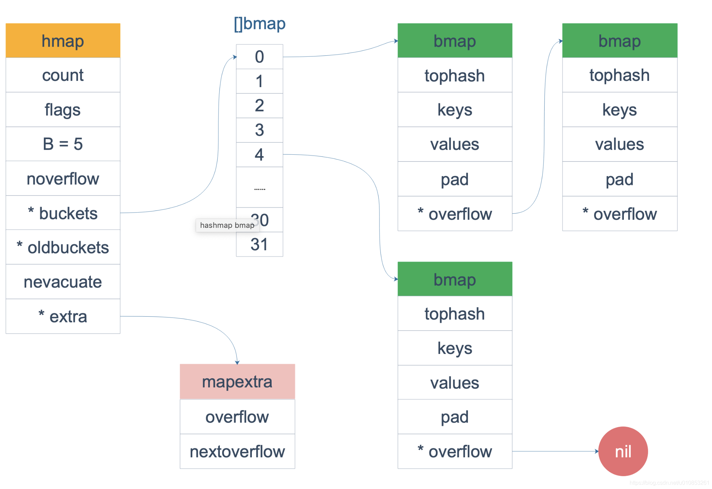

## 源码文件
src/runtime/map.go
## 数据结构
```golang
// A header for a Go map.
type hmap struct {
	count     int       // 键值对个数
	flags     uint8     // 状态标识
	B         uint8     // bucket数组的大小
	noverflow uint16 
	hash0     uint32    // hash 因子

	buckets    unsafe.Pointer // bucket数组指针，数组的大小为2^B
	oldbuckets unsafe.Pointer // previous bucket array of half the size, non-nil only when growing
	nevacuate  uintptr        // progress counter for evacuation (buckets less than this have been evacuated)

	extra *mapextra // optional fields
}

// mapextra holds fields that are not present on all maps.
type mapextra struct {
	overflow    *[]*bmap
	oldoverflow *[]*bmap

	nextOverflow *bmap
}

// A bucket for a Go map.
type bmap struct {
    tophash [bucketCnt]uint8
}
// 编译期重构的结构 bmap
type bmap struct {
    tophash  [8]uint8       // 每个key哈希值的高8位，加速访问；
    keys     [8]keytype
    values   [8]valuetype
    pad      uintptr
    overflow uintptr
}
```

## 注解
 - map使用hash表实现，并使用拉链法解决冲突。
 - map的value不可寻址,扩容过程中会发生键值对迁移。
 - map遍历时加入了随机数，让每次遍历的起始bucket的位置不一样。
 - 一个hmap存放了一个（数组大小为2^B个）buckets数组指针，
每个buckets可以存储8个键值对，当每个bucket存储的kv对到达8个之后，
会通过overflow指针指向一个新的bucket，从而形成一个链表。
随着键值对数量的增加，溢出桶的数量和哈希的装载因子也会逐渐升高，超过一定范围就会触发扩容，扩容会将桶的数量翻倍。

## key 定位过程
    key 经过哈希计算后得到哈希值，共 64 个 bit 位（64位机），
    计算它到底要落在哪个桶时，只会用到最后 B 个 bit 位。
    如果 B = 5，那么桶的数量，也就是 buckets 数组的长度是 2^5 = 32。
    eg : 10010111 | 000011110110110010001111001010100010010110010101010 │ 01010
    高八位 10010111 为桶的位置
    低B（5）位 01010 为桶的编号

## 插入
    装载因子已经超过 6.5；翻倍扩容
    // Maximum average load of a bucket that triggers growth is 6.5.
    // Represent as loadFactorNum/loadFactDen, to allow integer math.
    loadFactorNum = 13
    loadFactorDen = 2
    
 - 装载因子:=元素数量÷桶数量；
 - 哈希在存储元素过多时会触发扩容操作，每次都会将桶的数量翻倍，
 扩容过程不是原子的，而是通过 runtime.growWork 增量触发的，
 在扩容期间访问哈希表时会使用旧桶，向哈希表写入数据时会触发旧桶元素的分流(取模或者位操作来获取桶的编号)。
 除了这种正常的扩容之外，为了解决大量写入、删除造成的内存泄漏问题，哈希引入了 sameSizeGrow 这一机制，在出现较多溢出桶时会整理哈希的内存减少空间的占用。

## 删除
    哈希使用了太多溢出桶；等量扩容

## 查找
    1. 根据key计算出哈希值
    2. 根据哈希值低位确定所在bucket
    3. 根据哈希值高8位确定在bucket中的存储位置
    4. 当前bucket未找到则查找对应的overflow bucket。
    5. 对应位置有数据则对比完整的哈希值，确定是否是要查找的数据
    6. 如果当前处于map进行了扩容，处于数据搬移状态，则优先从oldbuckets查找。
