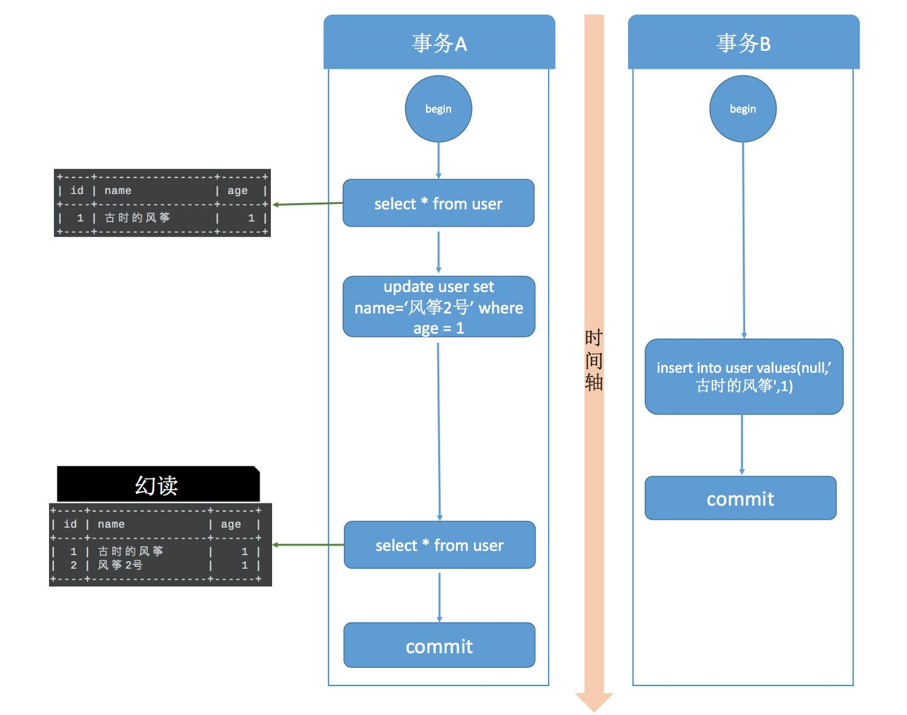
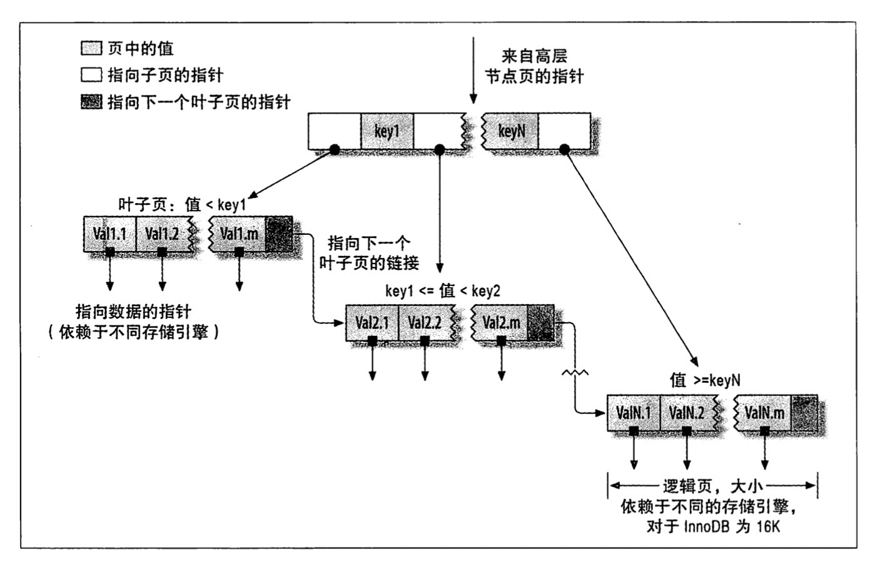
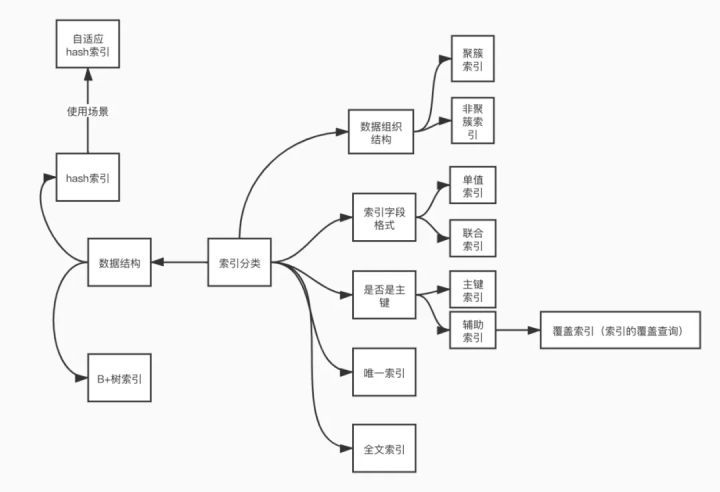

## 什么是事务
数据库的事务是指一组sql语句组成的数据库逻辑处理单元，在这组的sql操作中，要么全部执行成功，要么全部执行失败。
## 事务 ACID
- `原子性`(Atomicity)：一个事务（transaction）中的所有操作，要么全部完成，要么全部不完成，不会结束在中间某个环节。事务在执行过程中发生错误，会被回滚（Rollback）到事务开始前的状态，就像这个事务从来没有执行过一样。
- `一致性`(Consistency)：在事务开始之前和事务结束以后，数据库的完整性没有被破坏。这表示写入的资料必须完全符合所有的预设规则，这包含资料的精确度、串联性以及后续数据库可以自发性地完成预定的工作。
- `隔离性`(Isolation)：数据库允许多个并发事务同时对其数据进行读写和修改的能力，隔离性可以防止多个事务并发执行时由于交叉执行而导致数据的不一致。事务隔离分为不同级别，包括读未提交（Read uncommitted）、读提交（read committed）、可重复读（repeatable read）和串行化（Serializable）。
- `持久性`(Durability)：事务处理结束后，对数据的修改就是永久的，即便系统故障也不会丢失。
    
    ps：原子性、隔离性、持久性都是为了保障一致性而存在的，一致性也是最终的目的。

## 事务处理
1、用 BEGIN, ROLLBACK, COMMIT来实现
- BEGIN 开始一个事务
- ROLLBACK 事务回滚
- COMMIT 事务确认

2、直接用 SET 来改变 MySQL 的自动提交模式
- SET AUTOCOMMIT=0 禁止自动提交
- SET AUTOCOMMIT=1 开启自动提交

## 隔离级别（隔离性
### Read Uncommitted（读取未提交内容）RU
    在该隔离级别，所有事务都可以看到其他未提交事务的执行结果。
    读取未提交的数据，也被称之为脏读（Dirty Read）。
    set global transaction isolation level read uncommitted;
    eg:无法解决脏读

### Read Committed（读取提交内容）RC
    这是大多数数据库系统的默认隔离级别（但不是MySQL默认的）。它满足了隔离的简单定义：一个事务只能看见已经提交事务所做的改变。
    这种隔离级别 也支持所谓的不可重复读（Nonrepeatable Read），因为同一事务的其他实例在该实例处理其间可能会有新的commit，所以同一select可能返回不同结果。
    set global transaction isolation level read committed;
    eg:无法做到可重复读，也没办法解决幻读

### Repeatable Read（可重读）RR
    这是MySQL的默认事务隔离级别，它确保同一事务的多个实例在并发读取数据时，会看到同样的数据行。
    不过理论上，这会导致另一个棘手的问题：幻读 （Phantom Read）。简单的说，幻读指当用户读取某一范围的数据行时，另一个事务又在该范围内插入了新行，当用户再读取该范围的数据行时，会发现有新的“幻影” 行。
    MySQL 中在可重复读的隔离级别中解决了幻读。主要使用两种技术互相配合：MVVC 和 行锁和间隙锁（Next-Key)。
    set global transaction isolation level repeatable read;

### Serializable（可串行化）S
    这是最高的隔离级别，它通过强制事务排序，使之不可能相互冲突，从而解决幻读问题。
    简言之，它是在每个读的数据行上加上共享锁。在这个级别，可能导致大量的超时现象和锁竞争。

## 隔离级别引发的问题及其解决办法
- 脏读(Drity Read)：某个事务已更新一份数据，另一个事务在此时读取了同一份数据，由于某些原因，前一个RollBack了操作，则后一个事务所读取的数据就会是不正确的。读到了并一定最终存在的数据，这就是脏读。
- 可重复读(repeatable read)：可重复读指的是在一个事务内，最开始读到的数据和事务结束前的任意时刻读到的同一批数据都是一致的。通常针对数据更新（UPDATE）操作。
- 不可重复读(Non-repeatable read)：在一个事务的两次查询之中数据不一致，这可能是两次查询过程中间插入了一个事务更新的原有的数据。通常针对数据更新（UPDATE）操作。
- 幻读(Phantom Read)：在一个事务的两次查询中数据笔数不一致，例如有一个事务查询了几列(Row)数据，而另一个事务却在此时插入了新的几列数据，先前的事务在接下来的查询中，就有几列数据是未查询出来的，如果此时插入和另外一个事务插入的数据，就会报错。幻读是针对数据插入（INSERT）操作来说的。

## 一般公司数据库配置
    读提交级别 + binlog的row格式

## 锁
## MVCC(多版本并发控制)
## binlog
- statement:记录的是修改SQL语句
- row：记录的是每行实际数据的变更
- mixed：statement和row模式的混合

## 索引

### 什么是索引？
    索引（index）是帮助MySQL高效获取数据的数据结构，可以理解为`排好序`的`快速查找`数据结构。
    数据库维护一个特定查找算法的数据结构，这些数据结构以某种方式指向数据，可以用来快速查询数据表中的记录，这种数据结构为索引。
    索引本身也很大，不可能全部存储在内存中，往往以索引文件的形式存在磁盘上。

### 索引的优点？
1. 索引大大减少了服务器扫描的数据量
2. 索引降低数据排序成本，降低CPU消耗 
3. 索引可以将随机I/O变为顺序I/O，降低数据IO成本

### 索引的缺点？
1. 索引降低更新表的速度，更新表时，不光更新表，也要更新索引信息
2. 索引是提高效率的一个因素，当有大量的表，会根据业务人为进行变更优化

### 索引分类
- 根据底层数据结构划分
> - hash索引:
> - B+树索引:

- 根据索引字段个数划分
> - 单值索引：
> - 复合索引（联合索引）：

- 根据是否是在主键上建立的索引进行划分
> - 主键索引：每张表都必须有主键索引，主键索引只能有一个，不能为null同时必须保证唯一性。建表时如果没有指定主键索引，则会自动生成一个隐藏的字段作为主键索引。
> - 辅助索引：如果不是主键索引，则就可以称之为非主键索引，又可以称之为辅助索引或者二级索引。主键索引的叶子节点存储了完整的数据行，而非主键索引的叶子节点存储的则是主键索引值，通过非主键索引查询数据时，会先查找到主键索引，然后再到主键索引上去查找对应的数据。

- 根据数据与索引的存储关联性划分
> - 聚簇索引：将数据存储与索引放到了一块，找到索引也就找到了数据。Innodb的主键索引，非叶子节点存储的是索引指针，叶子节点存储的是既有索引也有数据，是典型的聚簇索引
> - 非聚簇索引：MyISAM中索引和数据文件分开存储，B+Tree的叶子节点存储的是数据存放的地址

- 其他分类
> - 唯一索引：不允许具有索引值相同的行，从而禁止重复的索引或键值
> - 全文索引

### 索引创建
1. 主键自动唯一索引
2. 频繁查找的列应该创建索引
3. 查询中与其他表关联的字段，外键关系建立索引
4. where用不到的字段不创建索引
5. 高并发下创建组合索引
6. 查询中排序的字段，排序字段如果按照索引去访问会提高排序速度
7. 查询中统计或分组字段

### 索引非创建
1. 表记录过少
2. 频繁更新的字段不适合创建索引
3. 数据列重复量过多

### 索引的选择性
不重复的索引值和数据表的记录总数（#t)的比值,范围从1/#t到1 之间，索引的选择性越高则查询效率越高。因为选择性搞的索引可以让mysql在查找时过滤掉更多的行。

### 全文索引？
- 只有Innodb和myisam存储引擎能用全文索引（innodb支持全文索引是从mysql5.6开始的）
- char、varchar、text类型字段能创建全文索引（fulltext index type）
- 全文索引的原理的倒排索引（一种数据结构），一般利用关联数组，在辅助表中存储单词与文档中所在位置的映射
- 内置分词解析器ngram支持中文
- 用MATCH() ... AGAINST 方式来进行搜索
- 三种类型的全文搜索方式
> -  natural language search（自然语言搜索）
> -  boolean search（布尔搜索）
> -  query expansion search（查询扩展搜索）

### 什么是前缀索引？
    ALTER TABLE table_name ADD KEY(column_name(prefix_length));
    概念：当索引是很长的字符序列（BLOB，TEXT或者长的VARCHAR）时，这个索引将会很占内存，而且会很慢，这时候就会用到前缀索引。索引开始的部分字符，这样可以大大节约索引空间，提高索引效率，但是会降低索引的选择性。
    前缀索引如何选择：一般的定义原则是 1.0 * count(distinct columnName)/count(*)
    好处和坏处：MySQL 前缀索引能有效减小索引文件的大小，提高索引的速度。但是前缀索引也有它的坏处：MySQL 不能在 ORDER BY 或 GROUP BY 中使用前缀索引，也不能把它们用作覆盖索引(Covering Index)。

### 覆盖索引？

### 索引合并？

### explain分析
- `id`: SQL执行的成功的标识

> - id全相同：从上到下执行
> - id全不同：如果是子查询，id的序号会递增，id值优先级越高，越先被执行
> - id相同不相同，同时存在：从大到小，从上到下

- `select_type`: 查询的类型
> - SIMPLE: 简单查询，不包含子查询和union
> - PRIMRARY: 包含子查询时的最外层查询; 使用union时的第一个查询
> - UNION: 包含union的查询中非第一个查询
> - DEPENDENT UNION: 与 UNION 相同，但依赖外层查询的结果
> - SUBQUERY: 子查询
> - DEPENDENT SUBQUERY: 依赖外层查询的子查询
> - DERIVED: 用于 FROM 中的子查询

- `table`: 对应行正在访问哪一个表，表名或者别名
- `type`: type显示的是访问类型，是较为重要的一个指标, 一般来说，得保证查询至少达到range级别，最好能达到ref。

    system > const > eq_ref > ref > range > index > all

> - ALL： MySQL进行全表扫描。
> - index：全索引扫描。index与ALL区别为index类型只遍历索引树
> - range：只检索给定范围的行，使用一个索引来选择行
> - ref：表示上述表的连接匹配条件，即哪些列或常量被用于查找索引列上的值
> - eq_ref： 类似ref，区别就在使用的索引是唯一索引，对于每个索引键值，表中只有一条记录匹配，简单来说，就是多表连接中使用primary key或者 unique key作为关联条件
> - const、system: 当MySQL对查询某部分进行优化，并转换为一个常量时，使用这些类型访问。如将主键置于where列表中，MySQL就能将该查询转换为一个常量,system是const类型的特例，当查询的表只有一行的情况下，使用system

- `possible_keys`: 列指出MySQL能使用哪个索引在该表中找到行。
- `key`: 列显示MySQL实际决定使用的键（索引）。如果没有选择索引，键是NULL。
- `key_len`: 列显示MySQL决定使用的键长度。如果键是NULL，则长度为NULL。使用的索引的长度。在不损失精确性的情况下，长度越短越好
- `ref`: 表示上述表的连接匹配条件，即哪些列或常量被用于查找索引列上的值。
- `rows`: rows列显示MySQL认为它执行查询时必须检查的行数。 
- `Extra`: 该列包含MySQL解决查询的详细信息

### B+树索引查找
从索引的根节点进行搜索，根节点的槽中存放了指向子节点的指针，通过比较节点页的值和要查找的值可以找到合适的指针进入下层子节点，要么找到记录要么不存在。

### 什么哈希索引？
哈希索引是基于哈希表实现，只有memory引擎支持哈希索引。memory使用链式解决冲突。
1. 哈希索引只包含哈希值和行指针，而不存储字段值，所以不能使用索引中的值避免读取行。
2. 哈希索引的数据不是按照索引值顺序存储的，无法用于排序。
3. 哈希索引也不支持部分索引列匹配查找。
4. 只支持等值比较

### MySQL不选择hash索引的原因？ 
1. hash表冲突会导致数据`碰撞` 
2. hash数据文件存储会使用更多内存
3. hash等值查找很快，但不支持范围查找，并且无法排序

### InnoDB能创建hash索引么？
1. InnoDB在内部利用哈希索引来实现其自适应哈希索引功能。
2. InnoDB注意到某些索引值被使用的特别频繁时，它会在内存中基于Btree的索引之上再创建一个HASH索引

### 二叉树，（二叉搜索树BST，(平衡二叉树AVL，红黑树为什么不能当MySQL索引
1. 当数据库的数据量特别大时，其深度也将特别大，由于MySQL 存储的数据最终是要落地到磁盘的，MySQL 应用程序读取数据时，需要将数据从磁盘先加载到内存后才能继续操作，所以这中间会发生磁盘 IO，而如果树太高，每遍历一层结点时，就需要从磁盘读取一次数据，也就是发生一次 IO，影响读取性能

### 什么是聚簇索引?什么是非聚簇索引？
- 聚簇索引：将数据存储与索引放到了一块，找到索引也就找到了数据
- 非聚簇索引（二级索引

### 索引失效？
1. 被索引字段，发生了隐式类型转换
2. 被索引字段使用了表达式计算
3. 被索引字段使用了函数
4. 在like关键字后，使用左模糊匹配 "%XX"
5. 被使用的索引字段，不是联合索引的最左字段

### 索引优化？
1. 使用伪hash索引
2. 对于BLOB，TEXT或者长的VARCHAR类型的类，使用前缀索引